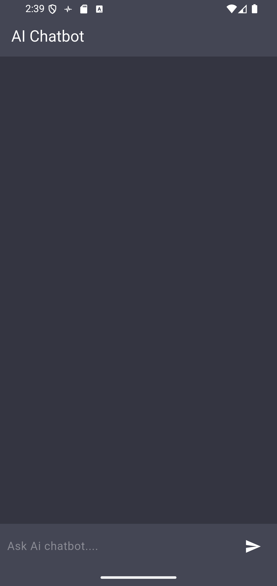
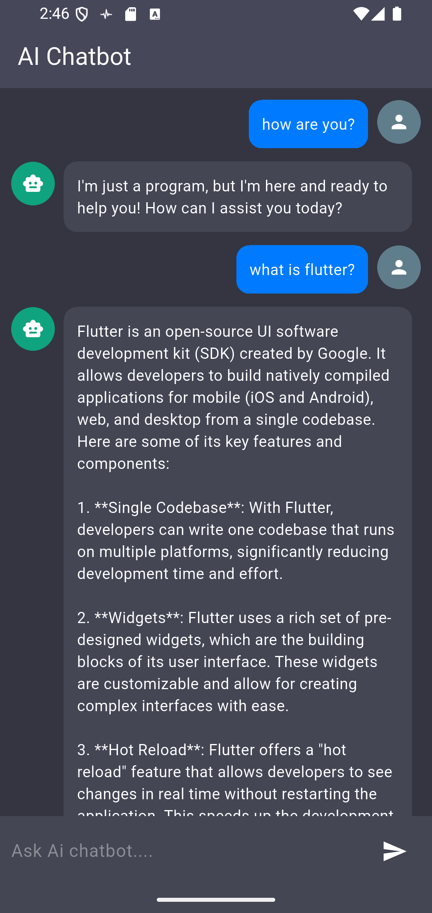

AI Chatbot 🤖

A sleek, responsive AI Chatbot built with **Flutter**. This application utilizes the **OpenRouter API** to connect with powerful LLMs (like GPT-4o-mini), providing a smooth conversational experience similar to ChatGPT.

🚀 Features

- **Real-time Interaction:** Fast and fluid chat interface.
- **AI Integration:** Seamlessly connected to OpenRouter's API.
- **Smart UI:** - Automated auto-scroll to the latest message.
    - Distinctive chat bubbles for User and Bot.
    - Integrated loading indicators for API calls.
- **Clean Architecture:** Organized code with dedicated models and constants.


🛠️ Tech Stack

- **Framework:** [Flutter](https://flutter.dev/)
- **Language:** [Dart](https://dart.dev/)
- **Networking:** [http](https://pub.dev/packages/http)
- **API Provider:** [OpenRouter](https://openrouter.ai/)


📸 Preview




⚙️ Setup & Installation

1. **Clone the repository:**
   ```bash
   git clone [https://github.com/GAPAGARILOKESH/AI-chatbot.git](https://github.com/GAPAGARILOKESH/AI-chatbot.git)